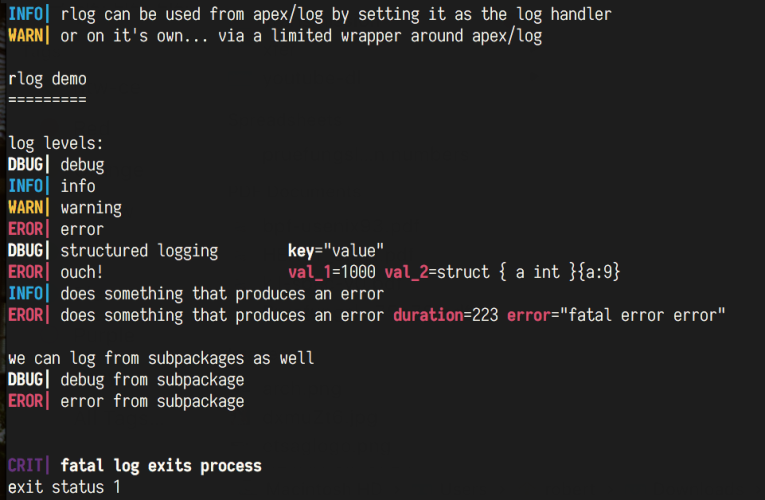

rlog
====

_rust log or robert's log if you like ;)_  
Mostly for my own projects, with inspiration taken from https://crates.io/crates/env_logger.

This package implements [`github.com/apex/log.Handler`](https://github.com/apex/log/blob/master/logger.go#L54). 
It also offers a subset of [`apex/log.Interface`](https://github.com/apex/log/blob/master/interface.go#L4) that can be used directly.

The environment variable `GO_LOG` can be used to set the log level. Like `env_logger` we support tuning it on a package
basis, e.g. `GO_LOG=warn,sub=debug` would only log warn/error/fatal messages with exception of in the `sub` package,
where all logs get through.



## Usage

Really simple, just import the package and use it:

```
package main

import "github.com/robertgzr/rlog"

func main() {
    rlog.Info("hello world!")
}
```

### To integrate with apex/log:

```
package main

import (
    "github.com/apex/log"
    "github.com/robertgzr/rlog"
)

func main() {
    log.SetHandler(rlog.Default)
    log.SetLevel(log.DebugLevel) // this overwrites the GO_LOG env

    log.Debugf("%s is a string", "a string")
}
```

## Examples

Run `GO_LOG=warn,subpkg=debug go run _example/main.go`
